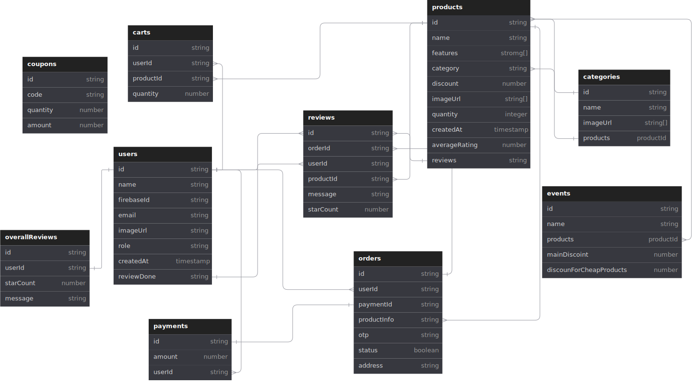

# IShop: Full Stack eCommerce App using MERN and Mongoose

A full-stack eCommerce application built using MongoDB, Express.js, React, Node.js, and Mongoose.

## Live Demo

Check out the live version of IShop: [IShop Live Demo](https://ishop-client.vercel.app/)

## Table of Contents

- [Features](#features)
- [Technologies Used](#technologies-used)
- [Installation](#installation)
- [Usage](#usage)
- [API Documentation](#api-documentation)
- [Demo Video](#demo-video)

## Features

- **User Authentication and Authorization:** Securely access the platform and manage user roles for enhanced security using Firebase.

- **Product Categorization:** Explore our extensive range of products conveniently organized into intuitive categories.

- **Sales Event Management:** Stay updated with exciting sales events and promotions to grab the best deals.

- **Popular Product Filtration:** Discover trending products based on popularity, reviews and most frequently sold.

- **Shopping Cart and Checkout:** Seamlessly add items to your cart and breeze through the checkout process.

- **Discount Coupon Management:** Enjoy exclusive discounts with our easy-to-use coupon management system.

- **Order Management:** Track your orders effortlessly and stay informed at every step of the process.

- **Product Reviews:** Share your experiences and read honest reviews from fellow shoppers.

- **Advanced Search Filters:** Find exactly what you're looking for with customizable search filters.

- **Admin Panel:** Manage your store efficiently with powerful admin tools and features.

- **Backend Validation and Middleware**: Utilize backend validation and middleware for data validation and processing.

- **Responsive Design:** Enjoy a consistent shopping experience across all devices.

## Technologies Used

- **Frontend**: React, TanStack Query, Tailwind CSS
- **Backend**: Node.js, Express.js, Mongoose
- **Database**: MongoDB
- **Authentication**: JWT, Firebase
- **Deployment**: Vercel
- **API Testing**: Postman

## Database Schema

ERD of IShop database



## Installation

### Prerequisites

- Node.js
- MongoDB

### Backend Setup

1. Clone the repository:
   ```bash
   git clone https://github.com/Irfat7/ishop-server
   ```
2. Navigate to the IShop-client:
   ```bash
   cd your-repo/ishop-server
   ```
3. Install dependencies:
   ```bash
   npm install
   ```
4. Setup environment variables: Create a .env file and add the following
   ```bash
   DB_USER
   DB_PASS
   DB_NAME
   ACCESS_TOKEN
   STRIPE_KEY
   ```
5. Start the backend server:
   ```bash
   nodemon script.js
   ```

### Frontend Setup

1. Clone the repository:
   ```bash
   git clone https://github.com/Irfat7/ishop-client
   ```
2. Navigate to the IShop-client:
   ```bash
   cd your-repo/ishop-client
   ```
3. Install dependencies:
   ```bash
   npm install
   ```
4. Setup environment variables:
   Create a .env.local file and add the following

   ```bash
   VITE_IMGBB_KEY
   VITE_BACKEND_URL
   VITE_API_KEY
   VITE_AUTH_DOMAIN
   VITE_PROJECT_ID
   VITE_STORAGE_BUCKET
   VITE_MESSAGING_SENDER_ID
   VITE_APP_ID
   VITE_STRIPE_PK_TEST
   VITE_STRIPE_SECRET
   ```

5. Start development server:
   ```bash
   npm run dev
   ```

## Usage

1. Open your browser and navigate to http://localhost:5173 to view the application.
2. Register a new account or log in with existing credentials.
3. Browse products, add them to the cart, and proceed to checkout.

## API Documentation

### Endpoints

#### JWT API

- `POST /api/jwt`: Generate token

#### Cart API

- `POST /api/carts`: Add product to cart
- `GET /api/carts/user`: Fetch cart of a user
- `PATCH /api/carts/user`: Update cart of a user
- `DELETE /api/carts/:cartId`: Delete product from cart

#### Category API

- `GET /api/categories/:categoryName`: Fetch all products under a category
- `GET /api/categories`: Fetch all the existing category
- `POST /api/categories`: Create a new category

#### Coupon API

- `POST /api/coupons`: Add new coupon code
- `DELETE /api/coupons/:couponId`: Delete a coupon code
- `PATCH /api/coupons/:couponCode`: Update an existing coupon
- `GET /api/coupons/:couponCode`: Fetch coupon by coupon code
- `GET /api/coupons`: Get all available coupon
- `PATCH /api/coupons/use-coupon/:couponCode`: Update coupon quantity after usage

#### Order API

- `POST /api/orders`: Create an order
- `PATCH /api/orders/:orderId`: Update order status by otp
- `GET /api/orders/:userId`: Fetch orders of a particular user
- `GET /api/orders/get-all`: Get all orders
- `GET /api/orders/get/last-digit`: Search order by last digit
- `GET /api/orders/not-reviewed/:userId`: Get the orders that not reviewed by a user
- `GET /api/orders/most-popular`: Get the products that most purchased

#### Overall review API

- `POST /api/overallReviews`: Create a new overall service review
- `GET /api/overallReviews`: Get all the overall service reviews

#### Payment API

- `POST /api/payment/create-payment-intent`: Initialize a payment intent
- `POST /api/payment/new-payment`: Create a new payment record

#### Product API

- `POST /api/products`: Launch a new product
- `GET /api/products/:productId`: Fetch a specific product
- `GET /api/products`: Get all the products
- `GET /api/products/items/search`: Search products
- `POST /api/products/:productId`: Update a product
- `DELETE /api/products/:productId`: Delete a product

#### Review API

- `GET /api/reviews/byUser/:userId`: Fetch review of a particular user
- `GET /api/reviews/byProduct/:productId`: Fetch review of a product
- `POST /api/reviews`: Create a new review of a product

#### Sale Event API

- `GET /api/events`: Fetch all of the sale events
- `POST /api/events`: Launch a new event
- `DELETE /api/events/:eventId`: Close an ongoing event

#### User API

- `GET /api/users/admin-check/:email`: Check whether someone is admin or not
- `GET /api/users/:email`: Fetch a user data
- `GET /api/users`: Fetch all the users
- `GET /api/users/id-map/getUser`: Get the user id of a user
- `POST /api/users`: Add a new user after successful firebase new account creation.
- `PATCH /api/users/changeRole`: Change role of users

## Demo Video

Check out this video to see a demonstration of the key features and functionality of this project:

[](https://youtu.be/PyzDNxLpJDw)
